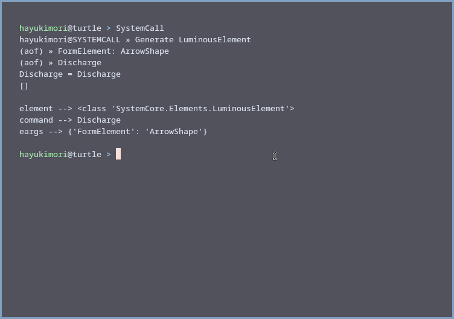

# CardinalShell

  

<div  id="Info">


</div>

<!--showcase-->


> CardinalShell is a python project, focused to recreate a usable shell supporting linear commands dynamically.


### Objectives
- [ ] Add support to multiple commands inline
- [ ]  Add speech recognition to SystemCall lib.
- [ ] Basic commands
- [ ]  Error handler

## How to run it
Some programs are required to run this application:

**Primary programs**
```
- Python 3.10+  (recommended: 3.12)
```
**Libs**
```
- colorama (pip)
```
Running application:
```
$ git clone https://github.com/hayukimori/CardinalShell/
$ cd CardinalShell
$ python csh.py
```

> [!WARNING]
> This application is still under development, please be aware that it is not fully functional, and may stop working during runtime
